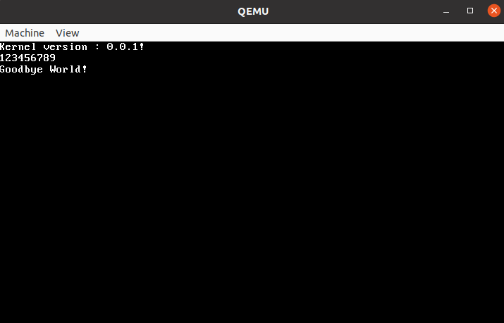

<br />
<p align="center">
  <a href="https://github.com/Bodanor/Kernel_C">
  </a>

  <h3 align="center">Kernel_C</h3>
  </p>
</p>


<details open="open">
  <summary><h2 style="display: inline-block">Table of Contents</h2></summary>
  <ol>
    <li>
      <a href="#getting-started">Getting Started</a>
      <ul>
        <li><a href="#prerequisites">Prerequisites</a></li>
        <li><a href="#Building the kernel">Installation</a></li>
      </ul>
    </li>
    <li><a href="#Boot the kernel">Usage</a></li>
  </ol>
</details>


## Getting Started

To get a local copy up and running follow these simple steps.

### Prerequisites

In order to build it you need the latest version of GCC, as, make.
To get them all run the following command on your terminal :

* build-essential
  ```sh
  sudo apt install build-essential
  ```

### Building the kernel

1. Clone the repo
   ```sh
   git clone https://github.com/Bodanor/Kernel_C.git
   ```
2. Change your current directory
   ```sh
   cd Kernel_C
   ```
3. Build the kernel
  ```sh
   make
   ```
4. Clean the working directory
  ```sh
   make clean
   ```
5. You sould know get a new file called :
  ```sh
   -rw-rw-r-- 1 liwinux liwinux 11448320 mei 15 20:04 kernel_X.X.X.iso
   ```


## Boot the kernel

In order to boot the newly created kernel you have 3 options :

1. Using QUEMU:
* If you don't have it, run this command :
```sh
  sudo apt install quemu
  ```
* Then simple run this command where the X correponds to right version of the kernel:
```sh
  qemu-system-x86_64 -cdrom kernel_X.X.X.iso
  ```

<br />
<p align="center">
  <a href="https://github.com/Bodanor/Kernel_C">
    
  </a>
</p>

2. Burning the ISO to a usb stick:
```sh
  sudo dd bs=4M if=kernel_X.X.X.iso of=/dev/your_usb_stick status=progress oflag=sync
  ```
3. Using VirtualBox or similar. [Here](https://docs.oracle.com/cd/E26217_01/E26796/html/qs-create-vm.html) is a link that explain of to boot an ISO in VirtualBox

